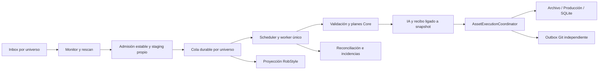

# NAP 2.0 — Fase 0: auditoría y arquitectura de automatización

Fecha: 2026-10-09. Repositorio: `robdor80/NAP`.
Base auditada: `main`, commit `57dfde0450b2fd70ce0803cb69e87fbdc393b216`.
Rama de este documento: `codex/nap-2-fase-0-auditoria`.

## Alcance y evidencia

Esta entrega es exclusivamente documental. **No implementa NAP 2.0 ni autoriza la Fase 1.** Se comprobó que el HEAD local coincide con `refs/heads/main` mediante una consulta Git de solo lectura. El checkout estaba limpio antes de crear la rama. No se cambiaron fuentes, dependencias, bases de datos ni assets; no se ejecutó producción, Git de ProductionRoot, auditoría remota ni la suite de pruebas.

**Hecho** significa comportamiento verificado por lectura de implementación en esta base, no una nueva prueba de ejecución. **Propuesta** significa contrato nuevo pendiente de implementación y revisión. Las pruebas existentes citadas se inspeccionan como especificación y puntos de regresión; no se presentan como ejecutadas en esta auditoría. El resultado de la preparación anterior del entorno no demuestra comportamiento de NAP 2.0.

La documentación complementaria consultada incluye [UI profesional](PROFESSIONAL_UI.md), [auditoría IA](AI_AUDIT.md), [recovery de Jobs](JOB_RECOVERY.md), [producción](PRODUCTION_STORAGE.md), [normalización](IMAGE_NORMALIZATION.md) y [Git de producción](GIT_PRODUCTION.md). Ante discrepancias, este diagnóstico se refiere al código del commit anterior.

## 1. Diagnóstico del problema

**Hecho.** NAP dispone de un motor de ejecución de un asset, pero no de un sistema de admisión y ejecución continua de paquetes. `ProfessionalUiService` ofrece operaciones individuales y `ShellViewModel` las enlaza con botones. No existe un watcher de Inbox, scheduler, cola persistente ni un recorrido automático de todos los candidatos. `Task.Run` evita bloquear la UI; no constituye una cola durable.

Los obstáculos concretos son:

1. Detección por snapshot cuando se refresca Producción/Historial/Inicio; no monitorización continua.
2. Selección de un candidato y tres acciones por paquete: preparar, auditar y publicar, más confirmación de publicación.
3. `Pipeline.Prepared` y `Pipeline.Audit` son evidencia de sesión. No se persisten los inputs necesarios para reconstruir el trabajo después de cerrar NAP.
4. `Prepare` genera un nuevo JobId tras staging; no hay relación durable Inbox → ZIP → Job. El journal solo almacena cuatro campos, sin ruta, hash, plan, auditoría, intentos o error.
5. Staging y extracción normales usan destinos compartidos derivados del nombre del ZIP. Repetir «Preparar» colisiona; no es una operación de reanudación.
6. `JobRecoveryScanner` enumera checkpoints, pero no los ejecuta ni reconstruye evidencia. La UI muestra Jobs sin ofrecer una reanudación general del pipeline.
7. `ActionAsync` convierte una excepción en estado detenido de página; no en una incidencia durable y aislada de cola.
8. Las actividades y la selección de outputs para Git residen en memoria. No permiten resumen fiable de un lote tras reinicio.

**Hecho importante.** El tramo final ya está automatizado dentro de `AssetExecutionCoordinator.Execute`: archivo, conversión/producción, verificación, registro SQLite y COMPLETED no requieren botones independientes. El cambio principal es suministrarle trabajos válidos, autorizados y recuperables; no reescribir esos motores.

**Objetivo propuesto.** Con una política global previamente autorizada, cada paquete admisible y con PASS real llega a COMPLETED sin clics. Un paquete incompatible, rechazado o ambiguo queda en incidencia y el resto continúa. «Autosuficiente» no significa reparar automáticamente colisiones, inventar PASS ni seguir tras pérdida de integridad del estado compartido.

## 2. Flujo manual actual demostrado

Las referencias son enlaces relativos a archivos del repositorio y nombres de métodos/commands, para que el siguiente desarrollo pueda localizar las fronteras sin depender de números de línea.

| Paso actual | Intervención y razón | Implementación comprobada |
| --- | --- | --- |
| Configuración inicial | Seleccionar universo y guardar WorkspaceRoot, ArchiveRoot y ProductionRoot existentes e independientes; configurar auditor real. Es autorización de ámbito, no trabajo repetible por asset. | [App.OnStartup](../src/NAP.App/App.xaml.cs) compone perfiles y auditor solo con `NAP_GEMINI_API_KEY` y `NAP_GEMINI_MODEL`. [LocalUniverseSettingsStore.Save/ValidateAvailable](../src/NAP.Core/LocalUniverseSettingsStore.cs) valida raíces. |
| Depositar ZIP | Copiar a `WorkspaceRoot/inbox` del universo. No hay selector automático de universo por nombre de archivo. | [UniverseStorageConfig](../src/NAP.Core/UniverseStorageConfig.cs): InboxRoot, StagingRoot, StateRoot y CatalogPath. |
| Ver candidatos | Ir a Producción/refrescar y seleccionar un ZIP. Snapshot de nivel superior, extensión `.zip` case-insensitive, orden determinista. | [ShellViewModel.RefreshCurrentAsync](../src/NAP.Presentation/ShellViewModel.cs), [ProfessionalUiService.Pipeline/PipelineAsync](../src/NAP.Presentation/ProfessionalUiServices.cs), [InboxPackageDetector.Detect](../src/NAP.Core/InboxPackageDetector.cs). |
| Preparar paquete | Pulsar «Preparar paquete». Se verifica que sea archivo ordinario del Inbox activo. No hay diálogo de confirmación en este comando. | `ShellViewModel.PreparePackage`, `ProfessionalUiService.PrepareAsync` y su helper `Prepare`. Botones en [PipelineView.xaml](../src/NAP.App/Views/PipelineView.xaml). |
| Staging | Automático dentro de Preparar: comprobar estabilidad, copiar ZIP a temporal y publicar sin overwrite. Un destino existente produce Collision. | [InboxPackageReadinessChecker.CheckAsync](../src/NAP.Core/InboxPackageReadinessChecker.cs), [InboxPackageStager.StageAsync](../src/NAP.Core/InboxPackageStager.cs). Defaults: dos muestras separadas un segundo; tamaño/mtime iguales y apertura exclusiva puntual. |
| Crear Job y extraer | Tras staging exitoso se crea Job DETECTED y se transiciona a STAGED; extracción a carpeta derivada del stem del ZIP, con temporal privado. | `ProfessionalUiService.Prepare`; [JobId.Create](../src/NAP.Core/JobId.cs), [JobStateStore.Create/Transition](../src/NAP.Core/JobStateStore.cs), [StagedPackageExtractor.ExtractAsync](../src/NAP.Core/StagedPackageExtractor.cs). |
| Validar y planificar | Automático: semántica, perfil/universo, archivos, PNG y geometría; VALIDATED; raíz, routing, snapshot estructural, validación de plan y plan de archivo; PLANNED. | [PackageSemanticValidator.Validate](../src/NAP.Core/PackageSemanticValidator.cs), [ImageConversionResolver.Resolve](../src/NAP.Core/ImageConversionResolver.cs), [ProcessingPlanBuilder.Build](../src/NAP.Core/ProcessingPlanBuilder.cs), [ProcessingPlanValidator.Validate](../src/NAP.Core/ProcessingPlanValidator.cs), [ArchiveMasterPlanner.Plan](../src/NAP.Core/ArchiveMasterPlanner.cs). |
| Auditar plan | Pulsar «Auditar plan». Requiere auditor configurado y paquete preparado. Guarda el resultado en `Pipeline.Audit`; todavía no transiciona el Job a AUDITED. | `ShellViewModel.AuditPackage`, `ProfessionalUiService.AuditAsync`, [AiAuditRequestBuilder.Build](../src/NAP.Core/AiAuditRequestBuilder.cs), [GeminiOperationAuditClient.AuditAsync](../src/NAP.AI/GeminiOperationAuditClient.cs). |
| Autorizar publicación física | Pulsar «Publicar asset» y aceptar diálogo con asset, Job y PASS. Solo habilitado con `audit.Passed`. Esta confirmación es la frontera explícita de escritura de la UI actual. | `ShellViewModel.ExecutePackage` y `Confirm`, `ProfessionalUiService.ExecuteAsync`. |
| Ejecutar hasta COMPLETED | Sin intervención adicional: verificar coherencia, tomar mutex Job, comprobar destino fresco, pasar PLANNED → AUDITED, ejecutar archivo y producción, EXECUTED, verificación física, VERIFIED, SQLite, COMPLETED. | [AssetExecutionCoordinator.Execute](../src/NAP.Core/AssetExecutionCoordinator.cs). |
| Revisar resultado | Refresco de catálogo/UI y lectura del journal. Actividad de sesión, con límite de 100 entradas, no historial durable completo. | `ShellViewModel.Record`, `RefreshCurrentAsync`; [ProfessionalUiModels.PipelineJob](../src/NAP.Presentation/ProfessionalUiModels.cs) no inventa timestamps ni pasos anteriores. |
| Git opcional posterior | Inspeccionar, escribir mensaje, crear commit y confirmarlo; seleccionar recibo, push y segunda confirmación. No es condición de COMPLETED. | `ShellViewModel.InspectGit/CommitGit/PushGit`, [GitProductionService.PrepareCommit/Commit/Push](../src/NAP.Core/GitProductionService.cs). |

En un paquete compatible, una vez configurado el universo, el recorrido exige seleccionar ZIP, Preparar, Auditar, Publicar y aceptar la confirmación; además puede requerir navegación/refresco. No existe un bucle de lote. No se atribuyen a la UI botones separados de archive, conversión o SQLite porque el código ya los integra.

### Variante excepcional: normalización y mapa de Treskal

**Hecho.** La geometría incompatible se detiene antes de PLANNED. El flujo ofrece preparar normalización, seleccionar perfil cuando corresponde, inspeccionar comparación, aprobar/rechazar y preparar candidato aprobado. `ApproveNormalization` separa el consentimiento de corrección de `production_profile` del consentimiento de ampliación de lienzo. `PrepareNormalizedAsync` reabre el recibo, exige decisión Approved y candidato ZIP, y usa directorios por operación e intento. Después siguen auditoría y publicación normales.

Fuentes: `ShellViewModel.PrepareNormalization/ApproveNormalization/PrepareNormalizedCandidate`, [ImageNormalizationService](../src/NAP.Core/ImageNormalizationService.cs), [contrato de normalización](IMAGE_NORMALIZATION.md). No se inspeccionó ni procesó el mapa real de usuario. Su caso motiva la ergonomía, pero no demuestra un defecto específico de sus archivos.

**Propuesta.** Normalización no pertenece al camino cero clics inicial. Un ZIP que ya cumple el contrato no necesita ella. Cambiar perfil o píxeles genera una derivación con decisión explícita, sin convertir el original incompatible en válido por tolerancia. Un candidato aprobado puede volver a la cola con lineage y validación completa. Automatizar esa decisión requeriría otro contrato y aprobación posterior.

## 3. Intervenciones manuales y destino propuesto

| Categoría | Operaciones | Tratamiento NAP 2.0 propuesto |
| --- | --- | --- |
| Técnica automatizable | Detectar, readiness, staging, extracción, validación, planning, solicitar IA, ejecutar coordinador, verificar, registrar, actualizar vista | Worker durable llama a contratos tipados; no simula clics ni reutiliza estado mutable de página. |
| Autorización global | Procesar Inbox de universos autorizados; escribir nuevos resultados en raíces congeladas tras PASS; consumo IA y límites | Política persistida/versionada aceptada una vez. Revocación y pausa comprobadas antes de admitir ejecución. Sustituye solo la confirmación normal de publicación. |
| Incidencia individual | ZIP inválido/peligroso, universo distinto, geometría inválida, asset_id con contenido distinto, WARNING/FAIL IA, evidencia inconsistente, destino ocupado | Detener el elemento afectado, conservar entradas y evidencias, mostrar diagnóstico y posible acción. Seguir otros elementos seguros. |
| Autorización humana excepcional | Normalización, cambio de perfil, reparación de estado/ownership ambiguo, restore/rebuild destructivo, eliminación/retención, cambios de raíces, conflictos Git | Mantener revisión concreta y explícita. La cola no borra, sobrescribe ni adopta resultados para despejar el bloqueo. |
| Política Git separada | Commit/push, rama/remoto, tamaño de lote | Desactivado por defecto; autorización específica por repositorio y modo. Nunca inferida de la autorización de publicación física. |

Los avisos técnicos no bloqueantes admitidos por una política no equivalen a un WARNING IA. El informe IA WARNING no habilita ejecución hoy y no la habilitará mediante un simple «continuar de todos modos».

## 4. Componentes reutilizables y adaptaciones necesarias

| Componente verificado | Garantía aprovechable | Adaptación/frontera nueva |
| --- | --- | --- |
| Inbox detector/preparer/readiness/stager | Snapshot determinista, muestreo, copia sin alterar Inbox, temporal y no-overwrite | Watcher + rescan, admisión durable, ownership de staging y deduplicación. `InboxPreparer` solo crea carpeta; no vigila. Readiness no prueba por sí solo finalización de copia. |
| Extractor + `ZipEntryIntegrity` | CRC, límites declarados/reales, rutas seguras, casing y duplicados, tipos peligrosos, publicación por rename | Usar extracción por QueueItem/Job, persistir evidencia antes/después, reconciliar residuos propios. Conservar límites, no aumentar por tamaño de lote. |
| PackageSemanticValidator + manifest/profile loaders | Envelope flat, reglas declarativas, required/extras, universo, clasificación, validadores soportados | Reconstrucción desde copias propias e identidad de perfil congelada; no serializar un `ValidatedAssetPackage` y confiar en él sin revalidar. |
| Resolver/builders/scan/plan validator | Routing explícito, contención y preflight estructural | Distinguir ejecución nueva de recovery: el validador de plan fresco detiene un destino existente; no aplicarlo indiscriminadamente a outputs propios ya publicados. |
| JobStateStore/StateMachine/RecoveryScanner | Journals atómicos, esquema v1 estricto, progresión y descubrimiento read-only | Sidecar de workflow y reconciliación; no agregar campos al journal v1. Lock por instancia del store no coordina instancias distintas; worker debe poseer exclusión real. |
| AiAuditRequestBuilder/Report/parser + Gemini client | STOP local precede IA; decisión coherente, HTTP real, `store=false`, errores no son PASS | Recibo durable enlazado a snapshot, clasificación tipada de transitorios, timeout/retry/circuit breaker. No analizar strings de error para decidir reintentos. |
| ArchiveMasterPlanner/Executor/index | Originales completos con manifest, SHA/tamaño, lock y copias faltantes; colisiones STOP | Política explícita para warning de maestro igual con otro ID y para `IndexExisting`; preservar recibos de intento y continuidad. No generalizar las reglas de ArchiveRoot a ProductionRoot. |
| ImageConversionResolver/Geometry/ProductionImageEngine | PNG→WebP declarado, límite de píxeles, ratio exacto, decode real y validación de WebP | Presupuesto de memoria y versión de motor congelada. Conversiones sin regla o tipos no soportados son incidencia, no inventar defaults. |
| ProductionAssetPlanner/Executor + ProductionExecutionEvidence | Mutex Production, no-overwrite, ownership mismo Job, outputs verificados | Cargar mismo Job y snapshots; probar todas las ventanas de caída. No prometer recuperación automática de finales sin ownership durable. |
| AssetExecutionCoordinator | Recovery PLANNED/AUDITED/EXECUTED/VERIFIED y COMPLETED coherente | Adaptador de workflow ajeno a UI, comprobación de recibo IA/política antes de entrar, límites de cancelación. Conservar estados y orden de registro. |
| AssetCatalog/CatalogBoundary | Registro insert-or-verify, fuentes revalidadas, transacciones, FK, DELETE/FULL y mutex | Cola separada del catálogo; post-check catálogo para reconciliar COMPLETED. No escribir SQL de assets desde scheduler. |
| GitProductionService/receipts | Plan exacto, paths propios, blobs verificados, commit y push independientes, recovery | Outbox durable de outputs terminados y política Git; no depender de `_verified` de sesión. Compatibilidad con HEAD remoto limita commit-only repetido. |
| Presentation/Shell/RobStyle | MVVM portable, componentes visuales, tonos, binding y guards de contexto | Nuevas proyecciones de cola y control global; lifecycle del worker en App. No usar `CurrentPage` o universo seleccionado como contexto del worker. |

### Límites de las garantías actuales

**Hechos verificados en código:**

- `JobStateStore.Load` acepta exactamente `schema_version`, `job_id`, `universe_id`, `state`. No hay event log, asociación a archivo ni informe IA. `JobStateMachine` hace FAILED y COMPLETED terminales.
- `ProfessionalUiService.Prepare` crea Job después de staging. Si falla extracción/validación, no captura el error para transicionar a FAILED ni conserva la asociación; puede quedar un journal temprano sin contexto suficiente. La automatización debe corregir esta orquestación, no fingir que recovery actual resuelve esa situación.
- `AiAuditRequestBuilder` manda metadata, roles, ruta relativa e issues del reporte recibido; **no manda píxeles ni bytes del ZIP**. Es auditoría de operación, no evaluación visual del mapa. `AiAuditReport` no contiene JobId, hash de request ni snapshot. `ExecuteAsync` comprueba scope del prepared y PASS, pero no una vinculación criptográfica entre report y plan.
- `Prepare` devuelve como `Validation` el reporte de `ProcessingPlanValidator`; comprueba `archive.Issues.ShouldStop`, pero no une los warnings del plan de archive en ese reporte IA. Una política de duplicados nueva debe tratar explícitamente esos avisos.
- Stager compara longitudes; no almacena SHA-256 de paquete. Abre exclusivamente durante readiness, lo cierra y abre después para copiar con `FileShare.Read`. Son handles distintos: no es una prueba de que nunca haya una carrera de copia.
- La publicación de staging/extracción es atómica por rename, pero `FlushAsync` de la copia no equivale al `Flush(true)` de journals y writers finales. No se ha demostrado resistencia a pérdida eléctrica de esas copias: antes de tratarlas como inputs durables, el adaptador deberá establecer su persistencia y revalidarlas tras reinicio, o mantenerlas como etapa reconstruible desde un origen verificado.
- `ProductionAssetPlanner` necesita conversión declarada y un maestro `png_master`; no basta con que un ZIP sea válido semánticamente para cualquier tipo futuro. El flujo cero clics inicial se limita a reglas productivas soportadas.
- Archive admite `IndexExisting` si los originales físicos exactos no están indexados y `AlreadyArchived` con índice/evidencia coherentes. Producción rechaza destino fresco existente incluso con bytes iguales: requiere ownership durable del **mismo Job**.
- `ProductionAssetExecutor` publica el archivo y después llama `evidence.Record`. Una caída entre ambos puede dejar final correcto sin ownership registrado: la revalidación lo rechaza. Esta ventana se conserva como incidencia segura; no se asegura exactly-once absoluto de efectos de filesystem.
- `VerifyCompleted` verifica archivo y producción; no registra ni consulta catálogo. Que el journal diga COMPLETED no demuestra que el catálogo siga presente/intacto después. El reconciliador futuro deberá comprobarlo sin reparar automáticamente.
- El coordinador es síncrono, sin CancellationToken. El wrapper revisa cancelación al comenzar, no entre cada escritura. Cancelar la pantalla o cerrar abruptamente no garantiza interrupción instantánea del motor.

## 5. Arquitectura propuesta de procesamiento automático

Todo este apartado es **propuesta nueva**.

### Fronteras y composición

- Core alojará contratos portables de workflow: `AutomationPolicy`, `QueueStore`, `InboxMonitor`, `PackageAdmission`, `ProcessingWorker`, `WorkflowRecovery`, `AuditReceiptStore` y `GitOutbox` (nombres propuestos, aún inexistentes). La persistencia usa Microsoft.Data.Sqlite ya presente; no requiere añadir un paquete para la cola.
- NAP.AI conserva cliente/parser, ampliando errores estructurados y límites sin cambiar FAIL por PASS.
- NAP.App compone un `AutomationHost` de duración de proceso. Arranca tras verificar configuración/política; atiende universos habilitados explícitamente, no solo el seleccionado en UI. Presentation observa snapshots/eventos y solicita pausa/reanudación.
- La preparación productiva debe extraerse de la dependencia UI a un servicio portable, con resultado tipado por etapa. Los adapters manuales delegarán a la misma frontera para evitar dos pipelines divergentes. No invocar commands de Shell desde scheduler.
- No es un servicio Windows ni daemon en esta propuesta: se procesa mientras NAP está ejecutándose, incluso en bandeja o en otra pantalla. Con NAP cerrado se conserva cola; se recupera al volver a abrir. Arranque al iniciar sesión sería opción posterior aprobada; no se promete ejecutar con Windows apagado o usuario desconectado.

### Detección y ZIP en copia

1. Snapshot al arrancar, tras reanudar y periódicamente; `FileSystemWatcher` como aviso acelerador, no fuente de verdad. Debounce por ruta y nueva exploración tras overflow/error del watcher. Reutilizar orden determinista del detector.
2. Validar raíz/ancestros y archivo ordinario sin reparse; `.partial` y otros sufijos no se admiten. Inbox no se recorre recursivamente. Cada Inbox tiene universo explícito; manifest ajeno es incidencia, no traslado automático.
3. Registrar observación barata de ruta, tamaño y mtime; muestrear hasta estable sin bloquear worker productivo. Valores iniciales propuestos: tres muestras en cinco segundos totales, configurables y sometidos a pruebas Windows.
4. Copiar bajo reglas de compartición seguras a staging privado; vincular operación antes de empezar. Hash SHA-256 y tamaño del ZIP staged, apertura/CRC completos en extractor y semántica sobre contenido extraído. Rechequear identidad de la observación para no asociar dos archivos distintos que reutilicen la misma ruta.
5. Si falta/cambia/está ocupado, seguir esperando con backoff acotado. Si el contenedor parece truncado tras estabilidad, mantener período de gracia antes de incidencia definitiva. No llamar a IA sobre una admisión no validada.

**Límite explícito:** tamaño/mtime estables y apertura exclusiva no demuestran que un productor haya terminado si este cierra el archivo entre ráfagas. Un ZIP estructuralmente completo puede además ser reemplazado después. Para garantía fuerte, documentar productor que copia a `.partial` y renombra a `.zip` al terminar, o señal de finalización vinculada por hash. Con copia directa se procesa exclusivamente el snapshot staged verificado, nunca bytes cambiantes de Inbox; no se puede prometer conocimiento absoluto de intención del escritor sin protocolo. Los tests deben cubrir pausa larga de copia, no solo escrituras continuas.

### Scheduler y concurrencia

Inicio: **un worker productivo global**, con planificación justa round-robin entre universos y FIFO por admisión dentro de cada uno. Una única conversión/auditoría activa simplifica locks, consumo IA y memoria; los mutex actuales son no bloqueantes, por lo que más workers causarían contención sin aportar capacidad segura. Monitorización y UI siguen activas; un Job en RetryScheduled o NeedsReview libera el worker.

Timeout IA acotado para que una petición colgada no monopolice la cola. La sincronización filesystem/SQLite final tiene secciones no cancelables; pausa se aplica a nuevas admisiones de ejecución y a checkpoints seguros, no matando un thread. No retener locks de escritura mientras se espera red IA.

Para 100/1.000 ZIP: metadata paginada, streaming de hash/copia, no precargar imágenes/planes de todo el lote, presupuesto de espacio y staging, límites de entradas por admisión y de trabajos pendientes. Los límites existentes de extractor son 10.000 entradas, 512 MiB por entrada y 2 GiB total por ZIP; el runtime actual admite hasta 64 millones de píxeles. Un límite por ZIP no limita la suma de 1.000 ZIP. Medir tiempos y memoria antes de aprobar paralelismo. Una fase futura podrá habilitar preparación/IA concurrente limitada y un writer por raíz; no forma parte del diseño inicial aceptado por defecto.

## 6. Cola persistente, identidades y recovery

### Almacenamiento y contrato mínimo

**Propuesta:** `StateRoot/automation/AutomationQueue.db` por universo, schema versionado propio. Separado de `AssetCatalog.db`, journals v1 y recibos de producción/Git. Directorio local controlado, no reparse, mismas comprobaciones de ámbito y estrategia DELETE/FULL, FK y transacciones; no copiar APIs internas de catálogo que asumen su schema. Bloqueo de dueño del host por StateRoot y transacciones compare-and-swap para claims. Dos procesos sobre las mismas raíces: solo uno adquiere propiedad; el otro muestra monitor read-only. Debe probarse en Windows real.

Entidades mínimas propuestas:

| Entidad | Datos persistidos y restricciones |
| --- | --- |
| QueueItem | QueueItemId, UniverseId, secuencia de admisión, origen/observaciones, BatchId, hash/tamaño ZIP, estado de cola, timestamps, retry count/next time, código de incidencia, snapshot/política vigente, revisión optimistic. Unique `(UniverseId, ZipSha256)` para una entrada de contenido exacto. Observaciones adicionales apuntan a ella. |
| WorkflowAttempt | Intento, QueueItemId, JobId preasignado, parent attempt opcional, rutas propias de staging/extracción, hashes por archivo y manifest, identidad/snapshot de profile, settings de conversión/runtime y planes reconstruibles. Unique JobId y un intento activo por item. |
| AssetReservation | UniverseId + AssetId, digest de paquete semántico y QueueItem/Job dueño; unique para impedir dos Jobs activos del mismo asset. Reserva solo tras validar manifest; ZIP inválido no inventa AssetId. |
| AuditReceipt | RequestId, hash canónico de request y snapshot completo, modelo/versión de contrato, decisión/parser, reporte validado, timestamps y número de intento. Nada de claves/tokens ni payloads HTTP sensibles. |
| QueueEvent | Secuencia por item, etapa, resultado/código, intento, tiempos y referencias a evidencia. Append transaccional con actualización del estado de cola; no reconstruir eventos pasados desde el journal. |
| Batch/GitOutbox | Cohorte de observaciones, resultado agregado; trabajos COMPLETED y evidencia verificada pendiente de operación Git con OperationId/receipt asociado. |

El hash de ZIP deduplica transporte exacto; el snapshot de todos los archivos por rol detecta el mismo paquete reempaquetado; AssetKey protege identidad de negocio; SHA de PNG detecta contenido maestro repetido. **Ninguno sustituye a los otros.** Mismo PNG no garantiza manifest/companions iguales.

No usar nombre/ruta, mtime, ZipSha aislado de universo ni UUID nuevo por cada scan como idempotency key. El JobId no tiene que volverse determinista: asignarlo una vez y persistir la relación es suficiente. Registrar intent de creación de Job antes de crear su journal; tras caída, reconciliar el JobId reservado sin crear otro.

### Estados de cola frente a estados de Job

La cola tendrá `Observed`, `WaitingStable`, `Queued`, `Running`, `RetryScheduled`, `NeedsReview`, `Rejected`, `Completed`, `Duplicate` y `MissingSource` (propuestos). `Running` lleva etapa durable, claim/generation y evidencia; no es permiso permanente para escribir. Estado de host separado: Disabled, Running, Pausing, Paused, Degraded y Blocked.

JobState se conserva: DETECTED → STAGED → VALIDATED → PLANNED → AUDITED → EXECUTED → VERIFIED → COMPLETED; FAILED terminal. Un timeout IA no convierte Job en FAILED ni lo resucita después: conserva PLANNED y programa retry en cola. Un fallo terminal explícito puede sellar FAILED; la revisión que permita nuevo intento deberá crear otro Job enlazado, solo tras resolver/reservar sus efectos y nunca automáticamente para eludir un destino ocupado. Priorizar mismo Job cuando sea recuperable.

### Deduplicación y segundo procesamiento

- Observación repetida del mismo ZIP: enlace al item existente, no nuevo Job ni nueva llamada IA por scan.
- ZIP reempaquetado, mismo manifest y archivos: alias al trabajo conocido después de comparar snapshot semántico completo. No crear Job productivo nuevo ni adoptar un directorio existente. Si está COMPLETED, verificar evidencia del mismo Job y catálogo antes de mostrar «ya completado».
- Mismo AssetKey con contenido distinto, incluidos companions o manifest: NeedsReview por colisión; no versionar, renombrar ni sobrescribir automáticamente.
- Distinto AssetKey con PNG idéntico: el Core emite Warning/Continue. Default propuesto: NeedsReview para posible duplicado; permitir por política explícita si se aprueba, manteniendo aviso y auditoría real. No deduplicar dos assets legítimos entre universos.
- Producción existente sin relación de workflow/Job/evidencia: incidencia aunque todos los hashes coincidan. El nuevo scheduler no ofrece «adoptar automáticamente».
- Jobs históricos v1 sin asociación: mostrar y permitir investigación; no asignar a ZIP por parecido ni importar como trabajo recuperable completo. Los assets previos permanecen intactos.

### Reconciliación al iniciar o recuperar un claim

No hay transacción distribuida entre cola, journal, filesystem, catálogo y Gemini. El protocolo usa intención durable, llamada al componente y reconciliación de su evidencia autoritativa. Claims expiran para planificación, pero solo un nuevo dueño comprobado puede ejecutarlos; un TTL no permite competir con un proceso vivo. Respetar mutex de host y Job antes de reasignar, y no envolver con otro lease Job la llamada al coordinador que ya lo adquiere.

| Punto de interrupción | Recuperación propuesta y condición |
| --- | --- |
| Antes de staging | Esperar archivo o reobservar. Sin salida productiva ni Job duplicado. |
| Staging/extracción en curso | Verificar operación/rutas/hash propios y final atómico. Residuo ambiguo a revisión; no borrar rutas por nombre ni promover temporales ciegamente. Una nueva copia solo bajo namespace nuevo reservado. |
| Job creado, queue update pendiente | Cargar JobId preasignado y comprobar universo/estado. Vincular si la intención y evidencia coinciden; conflicto a revisión. |
| STAGED/VALIDATED | Revalidar paquete y profile congelado; reconstruir planes desde bytes. Continuar solo transiciones pendientes. No llamar `PrepareAsync` actual, que haría staging y Job nuevo. |
| PLANNED con auditoría interrumpida | Repetir request tras política de retry si no hay recibo válido. No asumir PASS por petición enviada. Puede haber consumo duplicado remoto; no se promete exactly-once IA. |
| PASS recibido, aún PLANNED | Usar recibo persistido solo si snapshot/request/política siguen vinculados y validaciones frescas no tienen STOP; autorización global permite entrar al coordinador. |
| AUDITED / archivo parcial | Usar mismo Job y planes coherentes; archive revalida hashes/índice y coordina copias faltantes. Un `IndexExisting` no vinculado a una operación propia requiere revisión en modo automático. |
| Publicación parcial con recibo propio | `ProductionExecutionEvidence.Load` y planner comprueban mismo Job/snapshot y archivos. Escribir solo outputs faltantes autorizados por ese protocolo. |
| Archivo final publicado sin ownership durable | NeedsReview. Prohibido inferir ownership de igualdad de bytes o de mera intención previa. Mantener ventana segura hasta que un protocolo nuevo más fuerte sea aprobado y probado. |
| EXECUTED / VERIFIED | Coordinador revalida y puede repetir registro insert-or-verify antes de COMPLETED. No saltar la comprobación física. |
| SQLite committed, journal aún VERIFIED | Repetir registro coherente del mismo asset/Job y completar. Si discrepancia, STOP de ese Job; jamás reemplazar fila para cerrar el lote. |
| Journal COMPLETED, cola aún Running | Verificar archive/production del mismo Job y entrada física/catalog equivalente; cerrar cola y emitir resultado. No reejecutar escrituras de COMPLETED. |
| COMPLETED con archivo/catálogo ausente o corrupto | Incidencia de integridad; no volver a producir ni regenerar catálogo automáticamente. Separar restauración/rebuild autorizados del scheduler. |
| Cola o raíces compartidas corruptas/inaccesibles | Bloquear el ámbito afectado, conservar evidencia y mostrar motivo. Otros universos independientes pueden seguir; no ignorar corrupción compartida por cumplir el lote. |

El snapshot debe incluir hashes de manifest y de **todos** los archivos, perfil, routing, conversión, roots y versión de motor. Los paths originales usados por la evidencia actual se mantienen estables; mover el workspace no es recovery transparente. Cambios de profile/motor pueden modificar WebP regenerado y snapshot de producción: detener o migrar explícitamente, no aceptar hashes nuevos durante recovery.

Antes de marcar STAGED/VALIDATED en workflow, comprobar que la evidencia final es legible y exacta y definir su garantía de flush; si la copia desaparece tras pérdida eléctrica, no avanzar por el estado de cola. Reconstruir solo desde origen con el mismo hash y en namespace propio; si falta o cambió, incidencia. Del mismo modo, COMPLETED y outbox Git pueden quedar desacoplados por crash: una reconciliación idempotente añade una sola entrada de outbox desde el Job completado verificado, sin repetir producción.

### Auditoría IA, errores y reintentos

Recibo de PASS solo tras respuesta y parser correctos; no fabricar `new AiAuditReport(Pass, ...)` en scheduler de producción. Toda reutilización compara snapshot, request y ámbito, y ejecuta preflight fresco. El recibo es evidencia local protegida y verificable, no una firma del proveedor ni una garantía frente a administrador que altera todos los archivos.

Política inicial propuesta: timeout 60 s, hasta cinco intentos transitorios con backoff 5 s, 30 s, 2 min, 10 min (jitter y Retry-After si disponible), contadores durables y presupuesto global de peticiones/coste. Valores pendientes de aprobación/medición. Distinguir cancelación del usuario de timeout. Red/429/5xx: RetryScheduled; 401/403/config ausente: bloquear dependencia IA del ámbito y notificar; reporte inválido: incidencia sin PASS. FAIL/WARNING: NeedsReview sin reauditar indefinidamente hasta obtener una respuesta favorable. Una nueva auditoría exige cambio legítimo o solicitud explícita trazada.

Circuit breaker por dependencia evita 1.000 peticiones fallidas; otros trabajos pueden avanzar en admisión/validación sin archive/production, hasta límite de staging. Locks ocupados pueden reintentarse de forma acotada tras comprobar contention; no todo IOException es transitorio (colisión, archivo ausente o corrupción no lo son). Agotado retry: incidencia visible y reanudación explícita segura.

### Pausa, cierre y lotes

Pausa persistida por universo o global: no tomar nuevos trabajos; registrar Pausing si el coordinador está en una sección no cancelable, dejarla finalizar hasta checkpoint y pasar Paused. Reanudación restaura intención tras comprobar raíces/evidencia. El watcher puede observar durante pausa con backpressure, sin producir.

Cierre normal: pedir parada, dejar terminar unidad crítica y persistir resultado; UI ofrece esperar o salir conservando recuperación pendiente. Cierre forzado, reinicio/pérdida eléctrica: protocolo anterior. Bandeja mantiene host vivo; navegar o cambiar selector no cambia el contexto de ningún Job.

Inbox continuo no identifica por sí solo el lote que el usuario tenía en mente. Propuesta de BatchId automático por cohorte de admisiones con ventana de inactividad configurable; cerrar cohorte para resumen, sin bloquear la ejecución hasta ese cierre. Reobservaciones/duplicados conservan relación al lote donde se vieron. Denominador explícito: observaciones, paquetes únicos, completados, duplicados, incidencias y pendientes. «100 observados» no equivale a «100 completados».

## 7. Política de automatización y seguridad

**Propuesta:** política global versionada por universo, guardada fuera del checkout. Inicialmente Disabled. Activación única por responsable sobre raíces, perfil, operaciones admitidas, IA y presupuesto; tras autorizar, persistir habilitación para no pedir confirmación por asset/reinicio normal. Cambio de roots, perfil incompatible, scope o permiso invalida autorización hasta nueva revisión. Pausa/revocación son independientes del permiso.

Invariantes obligatorios:

1. Validación determinista estricta antes de IA y antes de publicar; STOP nunca es PASS ni «skip exitoso». No cambiar schemas/reglas para aceptar un mapa incompatible.
2. Contexto explícito y snapshots por universo; raíz validada y contenida en cada etapa. Ningún resultado depende del universo visible en Shell.
3. Extraer únicamente en namespace propio con límites y CRC; impedir traversal, rutas absolutas/ADS, colisiones por casing, links y tipos especiales. Inbox/ZIP original intactos.
4. Archive conserva maestro, manifest y companions con hashes/tamaños; no editar PNG original. Producción excluye el PNG maestro, genera WebP declarado y conserva documentación exacta.
5. `FileMode.CreateNew` y publicación no-overwrite; no borrar destino para desbloquear, ni usar `overwrite:true` sobre assets. Reemplazos controlados de journals/cola no autorizan reemplazo de producción.
6. Collision de AssetKey y contenido distinto siempre STOP; posible duplicado de otro ID sigue política registrada. Registrar avisos archive además de plan validator.
7. PASS real vinculado a evidencia + autorización global vigente son condiciones separadas. La autorización no sustituye IA y IA no autoriza scope de escritura por sí sola.
8. Revalidar fuentes, tamaño/SHA, WebP completo y decode/dimensiones; registro SQLite solo después de verificación y con contratos actuales. Una fila del catálogo no prueba integridad actual del asset.
9. Recovery con mismo Job y ownership verificable. No reparar COMPLETED, promover temporales sin prueba o apropiarse de finales desconocidos. Conservar estado FAILED terminal.
10. Eventos durables por etapa con identidad/política/intento/código; minimizar paths en vistas y secretos en logs. No guardar API keys, headers ni textos arbitrarios de transporte.
11. Espacio/memoria/límites por lote; si no puede persistirse progreso, no iniciar nuevas escrituras. Corrupción de cola o boundary compartido bloquea ese ámbito, no se maquilla como incidencia aislada sin consecuencias.
12. Retención/limpieza de Inbox, staging, históricos y backups fuera del camino inicial: sin borrado automático. Diseñar y autorizar después una política sobre archivos propios demostrables; de otro modo no puede sostenerse crecimiento ilimitado.

### Git: publicación física y publicación remota diferentes

COMPLETED significa asset físico y catálogo consistentes, **no** commit/push. Mostrar estados Git Pending/Committed/Pushed/Blocked separados. Un error de red Git no revierte ni vuelve a producir un asset.

Modos propuestos: Disabled (default), Manual, AutoCommitBatch y AutoCommitAndPushBatch. Autorizar repositorio/raíz, rama/upstream existentes, remoto y fingerprint, identidad, plantilla de mensaje y frontera de lote. Nada de `git add .`, force, reset, clean, pull/rebase automático, creación de upstream ni conflicto automático.

Reusar `PrepareCommit` con outputs verificables reconstruidos desde Jobs COMPLETED propios y outbox; hashes/ownership/paths exactos. Revalidar inmediatamente antes de commit; recibos actuales gobiernan recover/retry/push. Seleccionar todos los outputs dirty propios pendientes del repositorio o esperar una barrera: **el servicio actual exige que cada dirty path esté explicado por los resultados aportados**. Un lote parcial mientras otro produce puede fallar. Serializar frontera Git con writer del repositorio y recalcular plan, no ampliar selección a cambios ajenos.

**Limitación comprobada:** `RequireInitial` exige index limpio y `RemoteTip == HEAD`; tras un commit local sin push, otro commit nuevo no cumple esa precondición. AutoCommitBatch deberá cerrar un único commit y quedar Blocked/PendingPush hasta sincronización autorizada, o someter una ampliación explícita del contrato Git a revisión en Fase 7. No introducir push implícito para que commit-only parezca funcionar. Remoto avanzado, staged ajeno, atributos inseguros o falta de identidad: detener Git y mantener assets COMPLETED.

## 8. Experiencia de usuario RobStyle

**Propuesta:** Producción pasa de asistente por asset a panel operativo, conservando `RobStyle.xaml`, colores/typography/buttons/templates y semántica `UiTone`. No rediseñar el sistema visual durante automatización.

- Header persistente: «Automatización activa / pausada / degradada», universo o resumen multiuniverso, acción Pausar/Reanudar y razón concreta si no puede arrancar. Estado visible desde cualquier pantalla.
- Resumen: pendientes, activo y etapa, completados, incidencias, duplicados y espera IA; totales por cohorte y tiempo observado. Sin porcentajes inventados de un paso cuyo progreso no se conoce.
- Lista paginada/virtualizada de cola con filtros Pendientes, Activos, Completados, Incidencias y Lotes; asset si ya validado, ZIP, universo, etapa, intentos y última actualización.
- Incidencias accesibles sin detener navegación: código, causa comprensible, evidencia y próxima acción («esperando copia», «reintento en…», «revisión necesaria»). No un único error genérico que oculte cuál de 100 ZIP falló.
- Detalle por Job con timeline durable, snapshots/hashes, decisiones IA, archive/production/catalog y Git separado. Acciones específicas de revisión/reanudar habilitadas por contrato, no botón universal «forzar».
- Resumen de lote: observaciones y únicos, correctos/completados, ya conocidos, rechazados, pendientes y fallos transitorios; exportación futura sin secretos. Una incidencia no presenta el lote entero como fracasado ni completado.
- Ajustes de automatización: autorización inicial y límites, universos habilitados, comportamiento al abrir, presupuesto IA y política Git aparte. «Cero clics» se refiere a assets normales después de esa configuración.

`IsExecuting` de Shell deja de ser el bloqueo global del worker; solo controla commands interactivos. Navegación/catálogo permanecen disponibles. Cambiar roots/ejecutar restauración o normalización incompatible necesita coordinarse con host, pausar el scope y respetar locks. Cerrar una página cancela sus lecturas, no el trabajo productivo. No mantener objetos de ViewModel como evidencia del worker.

## 9. Plan de implementación: fases Codex 1–7

Cada fase debe tener cambios acotados, documento de contrato, pruebas propias y revisión independiente; no activar un camino incompleto en producción. Sus números corresponden a NAP 2.0, no a las fases históricas 1–17. La implementación empieza únicamente tras autorización posterior.

### Fase 1 — Contratos, política y cola durable

- **Objetivo:** establecer identidad, estados y persistencia antes de procesar nada.
- **Componentes:** nuevos contracts/QueueStore en Core; configuración local y modelos de read-only en Presentation.
- **Cambios:** schema de cola separado, intents, attempts, events, reservations, claims y política versionada; API typed sin SQL expuesto a UI; presupuesto/pausa. Especificar canonicidad de snapshot y transacciones. No modificar journals v1 ni catálogo.
- **Dependencias:** aprobar separación queue/catalog, habilitación global y exclusión entre instancias.
- **Riesgos:** doble claim, pérdida de vínculo Job, incompatibilidad de schema y archivo corrupto.
- **Pruebas:** reopen, rollback/corte, dos instancias, unique constraints, cross-universe, corrupción y paths reparse; sintéticas, sin producción.
- **Finalización:** contrato y store revisados, transiciones/claims durables y repetibles, sin worker ejecutor; especificación de recovery lista para Fase 4.

### Fase 2 — Monitorización y admisión segura de Inbox

- **Objetivo:** detectar automáticamente todos los paquetes y admitir cada contenido una vez.
- **Componentes:** detector/readiness/stager/extractor existentes + monitor/admission; cola Fase 1.
- **Cambios:** watcher+rescan, debounce/backpressure, rutas privadas, hash ZIP, alias de observaciones, finalización de copia y evidencia de staging/extracción. Reserva de JobId antes de crear journal; recuperación de intents iniciales. No publicar assets ni llamar IA.
- **Dependencias:** Fase 1 y decisión de protocolo recomendado `.partial`→`.zip`.
- **Riesgos:** eventos perdidos, copia pausada, mismo nombre nuevo, staging residual y disco lleno.
- **Pruebas:** 1/10/100/1.000 candidatos, overflow simulado, rename, copy lento/pausa larga, ZIP corrupto/hostil, reparse y repeat scan; originales y archivos ajenos intactos.
- **Finalización:** admisión durable y deduplicada, problemas aislados, ventana de caída de admisión reconciliada y límites de espacio probados.

### Fase 3 — Preparación reutilizable y auditoría durable

- **Objetivo:** llevar cada item admitido a PLANNED y decisión IA verificable, sin escritura productiva.
- **Componentes:** preparación hoy en ProfessionalUiService, validadores/plans Core, NAP.AI y receipt store.
- **Cambios:** extraer frontera UI, conservar mismo Job, snapshot completo/profile/routing/conversión y reserva AssetKey; incluir todos los issues relevantes; reporte persistido ligado a request y snapshot. Errores IA tipados, timeout/retry budget/circuit breaker. Adapter manual mantiene garantías.
- **Dependencias:** Fases 1–2 y política de warnings/duplicados.
- **Riesgos:** PASS reutilizado con otro plan, cambio de perfil, retry de FAIL para obtener PASS, costes duplicados.
- **Pruebas:** STOP no llama IA; mock HTTP PASS/WARNING/FAIL, timeout/429/5xx/401 y JSON inválido; alteración de archivo/profile invalida recibo; pipeline manual equivalente.
- **Finalización:** PLANNED y reporte reconstruibles tras restart; ninguna llamada archive/production; FAIL/WARNING no ejecutables y transitorios acotados.

### Fase 4 — Ejecución y reconciliación idempotente

- **Objetivo:** procesar un item autorizado hasta COMPLETED y recuperar solo lo demostrable.
- **Componentes:** worker/adaptador, AssetExecutionCoordinator, workflow recovery, receipts existentes y catálogo.
- **Cambios:** policy+PASS receipt gate, revalidación fresca/recovery diferenciada, same Job execution, reconciliación de journal/queue/catalog y outputs, cierre durable e incidencias. Mantener ventana final-sin-ownership como revisión; no cambios de adopción implícitos.
- **Dependencias:** Fases 1–3; decisiones sobre snapshots/versiones y tratamiento de archive IndexExisting.
- **Riesgos:** divergencia entre DBs/journal, ventana rename→receipt, regeneración WebP diferente, reentrancia/orden de locks.
- **Pruebas:** fault injection antes/después de cada publicación, receipt y transición; SQLite commit antes de COMPLETED; Completed inconsistente; ajenos idénticos; mismo Job idempotente; comparación byte/hash de fixtures y roots ajenas.
- **Finalización:** 1 ZIP sintético a COMPLETED sin prompts con política habilitada; recovery desde checkpoints e incidencias de ambigüedad demostrados; no overwrite ni repair automático.

### Fase 5 — Host continuo, cola y operación por lotes

- **Objetivo:** sostener flujo autónomo 1/10/100 ZIP, aislando fallos y con pausa/cierre seguros.
- **Componentes:** AutomationHost en App, scheduler Core, lifecycle/bandeja y agregación Batch.
- **Cambios:** worker global, fairness, startup/restart, scope por universo, pause/resume durable, scheduling de retry y límites; cerrar cohorte sin bloquear procesamiento. Activación global previamente autorizada; flags deshabilitados donde falta configuración.
- **Dependencias:** Fases 1–4 completas.
- **Riesgos:** starvation, cierre WPF durante write, falta de espacio, doble instancia y universo mutable.
- **Pruebas:** lotes mixtos, IA caída sin bloquear validación de otros, restart proceso en Windows, bandeja/navegación, pause entre etapas y writer activo; 1.000 ZIP como soak con presupuesto medido.
- **Finalización:** matriz de lotes funcional sin clics por asset; restart y pause fiables; tiempo/memoria/espacio publicados y ninguna excepción de item mata host independiente.

### Fase 6 — UX de automatización e incidencias

- **Objetivo:** hacer cola, resultados y revisión excepcionales comprensibles sin volver a wizard por asset.
- **Componentes:** Shell/Pipeline/History/Dashboard, nuevos projections/ViewModels, Views y RobStyle existente.
- **Cambios:** estado global, listas virtualizadas, detalle durable, filtros/resumen de lote, pausa/reanudar y revisión específica; mantener normalización explícita y Git separado. Navegación desacoplada de worker; eliminar dependencia de `_verified` para nueva outbox.
- **Dependencias:** API de host Fase 5 y policy/incident contracts.
- **Riesgos:** contexto cruzado, refrescos costosos de 1.000 filas, botones que autorizan de más, errores escondidos.
- **Pruebas:** ViewModels portables, cross-universe y binding; smoke WPF en Windows, lista grande, bandeja, pantalla no activa; contador/timeline coinciden con DB tras reopen.
- **Finalización:** revisión visual RobStyle aprobada, cero prompts normales, controles accesibles y ninguna vista necesaria para seguir procesando.

### Fase 7 — Git configurable y aceptación integral

- **Objetivo:** añadir cierre Git opcional seguro y certificar la operación completa.
- **Componentes:** GitOutbox/policy, GitProductionService y receipts, detalle/resúmenes y documentación operativa.
- **Cambios:** default Disabled, barrera de repositorio, reconstitución de outputs propios, commit/push separados, recovery/outbox; explicitar limitación RemoteTip==HEAD de commit-only. Solo ampliar ese contrato con aprobación específica. Sin cambios a reglas no-overwrite de assets.
- **Dependencias:** Fases 1–6, aprobación de política Git y repositorios/remotos.
- **Riesgos:** dirty ajeno, commit parcial de lote, remoto movido, push duplicado, producción concurrente y políticas excesivas.
- **Pruebas:** repositorios y remotos locales temporales, nunca ProductionRoot real; dirty ajeno/index previo, stale plan, crash commit/push, red caída simulada, modo Disabled sin comandos mutantes; matriz final Windows y rendimiento sintético.
- **Finalización:** siete fases revisadas, matriz de aceptación satisfecha, Git fallo no altera COMPLETED, guía de recovery/rollback/configuración y límites documentados. No merge/publicación sin autorización del responsable.

## 10. Riesgos, decisiones pendientes y aceptación

### Decisiones que requieren aprobación del responsable

| Decisión | Recomendación del diseño | Consecuencia si se cambia |
| --- | --- | --- |
| Consentimiento global | Activación por universo, raíces y política versionada; PASS real obligatorio | Define exactamente qué sustituye al diálogo «Publicar asset». |
| Ejecución/lifecycle | Un worker global mientras NAP abierto, bandeja incluida; autoarranque Windows fuera del primer alcance | Servicio siempre activo necesita otro diseño operativo y permisos. |
| Persistencia | Queue DB separada bajo StateRoot, journals v1 intactos | Integrar en catálogo requeriría migración, backups y boundaries nuevos. |
| Copia a Inbox | Recomendar rename de `.partial` al final; soporte conservador de copia directa | Sin protocolo no existe garantía absoluta sobre intención del productor. |
| Duplicados/warnings | Mismo asset distinto contenido STOP; mismo maestro distinto ID a revisión por defecto | Autorizar permitir duplicado conserva aviso, no modifica IA. |
| Archive IndexExisting | No adoptar automáticamente preexistentes sin continuidad propia demostrada | Si se desea preservar compatibilidad amplia, aprobar condiciones específicas de adopción de archivo, nunca producción. |
| Normalización | Excepcional y humana, incluidos cambios de perfil | Automatizarla supone aprobación editorial y contrato distinto. |
| Recovery ambiguo | Final sin ownership a revisión; legacy Jobs no inferidos | Resolver más ventanas automáticamente requiere prueba de ownership más fuerte, no solo hashes. |
| IA | Aprobar modelo, timeout, retry/coste y scope del auditor de operación | No incluye auditoría visual ni depende de RoDo conversacional. |
| Git | Disabled por defecto; autorización separada y barrera por repositorio | Commit-only repetido necesita ampliar contrato o bloquear hasta push autorizado. |
| Retención y migraciones | Sin limpieza automática inicial; pausar en cambio de profile/motor/roots | Operación prolongada necesita presupuesto y futura retención propia autorizada. |

Las decisiones anteriores son propuestas para aprobar antes de sus fases dependientes; esta auditoría no pide valores secretos ni autoriza nuevas operaciones.

### Matriz de aceptación verificable

Todos los escenarios futuros usan fixtures sintéticas en raíces temporales aisladas, perfiles productivos válidos y auditor controlado para resultados deterministas. Complementar con una comprobación supervisada del proveedor real una vez configurado, separando disponibilidad externa de corrección del worker. No reutilizar assets reales de usuario para tests. En cada caso capturar inventario/hash previo de Inbox y assets ajenos, verificar journals/cola/catalog/receipts, contadores de llamadas y operaciones de escritura; exigir invariancia de ajenos y ausencia de overwrite.

| Escenario mínimo | Resultado exigido |
| --- | --- |
| 1 ZIP válido | Con política habilitada y PASS, exactamente un item y Job productivo, COMPLETED con archive exacto, WebP válido, companions y fila equivalente; cero clics de preparación/auditoría/publicación. |
| 10 ZIP válidos | Diez assets únicos completados sin prompts, lista coherente y resumen durable después de reabrir. |
| 100 ZIP válidos | Cien completos, sin pérdida por watcher ni selección de pantalla; métricas de duración, coste, pico RAM y disco registradas, no promesa de tiempo sin medir. |
| 1.000 ZIP válidos, soak | Cola paginada/backpressure, memoria no proporcional a imágenes pendientes, límites de disco respetados y ningún item perdido; umbrales de recursos acordados tras medición de 100. |
| Mixto: válidos, inválidos, duplicados | Válidos COMPLETED; inválidos con código/etapa; aliases exactos sin otro Job ni otro output; mismo ID distinto contenido a revisión; maestro repetido según policy, sin mezclar universos. |
| ZIP todavía copiándose | WaitingStable y sin IA/publicación prematura; prueba copia sostenida, pausa larga, lock/reopen y rename final. Truncados no terminan COMPLETED. Snapshot admitido identificado por hash. |
| Reinicio durante procesamiento | Caídas en admisión, journal, IA, archive, cada Move/Record, SQLite y COMPLETED; mismo Job cuando recuperable, ninguna transición inventada; ventanas ambiguas visibles sin bloquear válidos ajenos. |
| Auditoría interrumpida | Retry acotado/durable para transitorios, sin PASS artificial ni writes productivos; FAIL/WARNING visibles sin retry automático para cambiar veredicto; 401/403 degrada ámbito IA. |
| Colisión producción existente | STOP aunque bytes iguales si no hay ownership del mismo Job; ni cambios ni adopción, el siguiente paquete seguro continúa. |
| Segundo procesamiento del mismo lote | Ningún Job/output/registro duplicado, ninguna reescritura ni nueva IA innecesaria. Reempaquetado idéntico se reconoce por snapshot; inconsistencias de completados no se reparan. |
| Error frente a assets ajenos | Hashes, tamaños, contenido y namespaces ajenos invariantes en todos los anteriores; ZIP hostil nunca escribe fuera de su raíz; dirty Git ajeno nunca entra al commit. |
| Pausa/reanudación y UI | Pausa persistente, sin nuevos writers; activo termina sección segura; navegar, cambiar filtro/universo visible y bandeja no detienen ni redirigen Job. |
| Dos instancias/universos | Solo un dueño por scope, sin doble claim/publicación; mismo asset_id en universos distintos físicamente aislado. |
| Catálogo/cola dañados o disco lleno | No fabricar finalización; scope bloqueado diagnosticado, evidencia conservada, otros scopes independientes protegidos. |
| Git opcional | Disabled no muta Git; commit y push tienen resultados separados; fallo/stale/dirty ajeno conserva assets COMPLETED y outbox, sin force/reset ni rollback de producción. |

### Pruebas existentes a conservar y ampliar

- [InboxPackageReadinessCheckerTests](../tests/NAP.Tests/InboxPackageReadinessCheckerTests.cs), [InboxPackageStagerTests](../tests/NAP.Tests/InboxPackageStagerTests.cs), [StagedPackageExtractorTests](../tests/NAP.Tests/StagedPackageExtractorTests.cs): stability, colisiones, CRC, rutas hostiles, límites y limpieza solo del temporal propio.
- [AssetExecutionCoordinatorTests](../tests/NAP.Tests/AssetExecutionCoordinatorTests.cs): `EarlyAndFailedJobsAreRejectedWithoutChangingAnything`, `DurableCheckpointAfterPublicationResumesUsingSameJobProvenance`, `FailureAfterArchiveLeavesAuditedAndCanResumeProduction`, `CompletedInconsistencyIsStopAndNeverRepaired`, `TwoUniversesWithSameAssetIdRemainPhysicallyIsolated`. El test de ZIP Nimroel usa fixture del repo; no equivale a lote automático ni prueba de crash en toda instrucción.
- [ProductionOwnershipTests](../tests/NAP.Tests/ProductionOwnershipTests.cs), [ProductionSafetyTests](../tests/NAP.Tests/ProductionSafetyTests.cs), [ArchiveVerificationTests](../tests/NAP.Tests/ArchiveVerificationTests.cs) y [CatalogPipelineTests](../tests/NAP.Tests/CatalogPipelineTests.cs): ownership, originales, verificación y registro. Ampliar con fallos entre filesystem/receipts/DB.
- [GeminiOperationAuditClientTests](../tests/NAP.Tests/GeminiOperationAuditClientTests.cs) y [ProfessionalUiTests](../tests/NAP.Tests/ProfessionalUiTests.cs): HTTP fake y gate WARNING/FAIL; añadir linkage durable, retries y política global sin relajar gate.
- [GitProductionRecoveryPushTests](../tests/NAP.Tests/GitProductionRecoveryPushTests.cs), [GitProductionCommitTests](../tests/NAP.Tests/GitProductionCommitTests.cs), [GitProductionSecurityTests](../tests/NAP.Tests/GitProductionSecurityTests.cs): conservar validación exacta y agregar barrera/outbox y commit-only.

Las fases deberán ejecutar suites focalizadas que realmente ejerciten sus cambios y regresiones de seguridad; la certificación final añade Windows WPF e integración sintética completa. No exigir ejecutar hoy toda la suite para una modificación documental.

### Condición para comenzar Fase 1

Este documento deja identificados contratos, ubicaciones de persistencia, estados, invariantes, huecos de recovery, alcance del auditor, límites Git y pruebas base. Antes de implementar, el responsable debe autorizar la Fase 1 y las decisiones de política/persistencia que la condicionan. Se podrá comenzar por contratos y cola **sin activar automatización ni tocar producción**. Esta entrega termina en Fase 0 y no crea PR ni merge.
